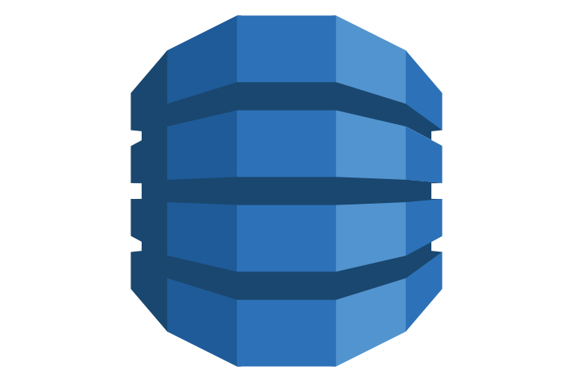

# hackathon-video-solicitation-microservice


## Objetivo



Este microsserviço é responsável por receber solicitações de processamento de vídeos, persistir os metadados e status de cada vídeo, e garantir escalabilidade e confiabilidade. O serviço foi projetado para suportar múltiplos vídeos por usuário, manter o histórico de status, e facilitar integrações com outros sistemas de processamento e mensageria.

## Justificativa da Escolha pelo DynamoDB

O DynamoDB foi escolhido por ser um banco NoSQL totalmente gerenciado pela AWS, ideal para aplicações distribuídas e escaláveis. Os principais motivos:

- **Escalabilidade automática**: suporta alto volume de operações de leitura e escrita.
- **Alta disponibilidade e resiliência**: replicação automática e tolerância a falhas.
- **Baixa latência**: ideal para atualização rápida de status e consultas.
- **Simplicidade operacional**: não exige administração de servidores ou clusters.
- **Integração com arquitetura baseada em eventos**: facilita o processamento paralelo e desacoplado de vídeos.

Essas características tornam o DynamoDB perfeito para microsserviços que precisam processar múltiplos vídeos simultaneamente, armazenar status de processamento e garantir confiabilidade.

## Como rodar localmente

### Pré-requisitos
- [Docker](https://www.docker.com/) instalado
- [NoSQL Workbench for DynamoDB](https://docs.aws.amazon.com/amazondynamodb/latest/developerguide/workbench.html) instalado (opcional, para testes e visualização da tabela)

### Passos
1. Clone o repositório e navegue até a pasta do projeto.
2. Rode o comando abaixo para subir o ambiente:

```powershell
docker-compose up
```

Isso irá:
- Subir o ambiente LocalStack (simulando AWS: S3, SNS, SQS)
- Subir o DynamoDB Local na porta 8000

### Testando e conectando
- Use o **NoSQL Workbench for DynamoDB** para conectar em `http://localhost:8000` e visualizar/testar a tabela criada.
- Você pode consultar, inserir e atualizar dados diretamente pelo Workbench.


## Modelagem de dados DynamoDB (planejada)

A tabela `Videos` foi modelada para suportar consultas eficientes e escalabilidade:

- **Partition Key:** `user_id` (permite buscar todos os vídeos de um usuário)
- **Sort Key:** `id` (identifica cada vídeo)
- **Atributos:**
  - `user_name`
  - `user_email`
  - `file_name`
  - `duration_seconds`
  - `size_bytes`
  - `status`
  - `bucket_name`
  - `video_chunk_folder`
  - `image_folder`
  - `download_url`
  - `error_cause`
  - `created_at`
  - `updated_at`

**Índices:**
- **LSI:** ordenação por data (`created_at`) para consultas por usuário.
- **GSI:** busca direta por vídeo (`id`).

## Diagrama da modelagem DynamoDB

```mermaid
erDiagram
    USER ||--o{ VIDEO : "possui"
    VIDEO {
        string id PK, GSI
        string user_id PK
        string user_name
        string user_email
        string file_name
        int duration_seconds
        int size_bytes
        string status
        string bucket_name
        string video_chunk_folder
        string image_folder
        string download_url
        string error_cause
        string created_at LSI
        string updated_at
    }
```

## Rotas disponíveis para teste rápido

- **POST /videos**
  - Upload de vídeo (multipart/form-data)
- **GET /videos/user/:user_id**
  - Listar vídeos de um usuário
- **GET /videos/:id**
  - Buscar vídeo por ID
- **PUT /videos/:id**
  - Atualizar status ou informações do vídeo

## Exemplo de Payload para POST /v1/videos

```json
{
  "user": {
    "id": "123",
    "name": "fulano",
    "email": "teste@hotmail.com"
  },
  "metadata": {
    "file_name": "video-teste.mp4",
    "duration_seconds": 60,
    "size_bytes": 123456
  },
  "frames_per_second": 1
}
```

> Envie esse JSON no corpo da requisição para criar um vídeo.

## Dúvidas?
