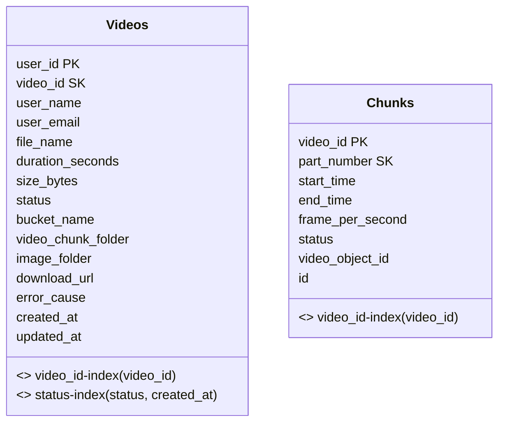

# hackathon-video-solicitation-microservice

## Objetivo

Este microsserviço é responsável por receber solicitações de processamento de vídeos, persistir os metadados e status de cada vídeo, e garantir escalabilidade e confiabilidade. O serviço foi projetado para suportar múltiplos vídeos por usuário, manter o histórico de status, e facilitar integrações com outros sistemas de processamento e mensageria.

## Justificativa da Escolha pelo DynamoDB

O DynamoDB foi escolhido por ser um banco NoSQL totalmente gerenciado pela AWS, ideal para aplicações distribuídas e escaláveis. Os principais motivos:

- **Escalabilidade automática**: suporta alto volume de operações de leitura e escrita.
- **Alta disponibilidade e resiliência**: replicação automática e tolerância a falhas.
- **Baixa latência**: ideal para atualização rápida de status e consultas.
- **Simplicidade operacional**: não exige administração de servidores ou clusters.
- **Integração com arquitetura baseada em eventos**: facilita o processamento paralelo e desacoplado de vídeos.

Essas características tornam o DynamoDB perfeito para microsserviços que precisam processar múltiplos vídeos simultaneamente, armazenar status de processamento e garantir confiabilidade.

## Como rodar localmente

### Pré-requisitos
- [Docker](https://www.docker.com/) instalado
- [NoSQL Workbench for DynamoDB](https://docs.aws.amazon.com/amazondynamodb/latest/developerguide/workbench.html) instalado (opcional, para testes e visualização da tabela)

### Passos
1. Clone o repositório e navegue até a pasta do projeto.
2. Rode o comando abaixo para subir o ambiente:

```powershell
docker-compose up
```

Isso irá:
- Subir o ambiente LocalStack (simulando AWS: S3, SNS, SQS)
- Subir o DynamoDB Local na porta 8000

### Testando e conectando
- Use o **NoSQL Workbench for DynamoDB** para conectar em `http://localhost:8000` e visualizar/testar a tabela criada.
- Você pode consultar, inserir e atualizar dados diretamente pelo Workbench.

## Modelagem DynamoDB

### Tabela de vídeos
- Partition Key: user_id
- Sort Key: video_id
- GSI 1: video_id-index (busca por id do vídeo)
- GSI 2: status-index (busca por status e ordena por created_at)

**Campos salvos em cada item:**
- video_id
- user_id
- user_name
- user_email
- file_name
- duration_seconds
- size_bytes
- status
- bucket_name
- video_chunk_folder
- image_folder
- download_url
- error_cause
- created_at
- updated_at

### Tabela de chunks
- Partition Key: video_id
- Sort Key: part_number
- GSI: video_id-index (busca todos os chunks de um vídeo)



## Endpoints

### Criar solicitação de processamento de vídeo
- **POST** `/v1/videos`
- **Body (JSON):**
```json
{
  "user": {
    "id": "456",
    "name": "fulano",
    "email": "teste@hotmail.com"
  },
  "metadata": {
    "file_name": "video-teste.mp4",
    "duration_seconds": 60,
    "size_bytes": 123456
  },
  "frames_per_second": 1
}
```

### Buscar link de download de um vídeo por ID
- **GET** `/v1/videos/{video_id}/download`
- Não passa nada no body, só o `video_id` na URL.

### Buscar todos os vídeos de um usuário
- **GET** `/v1/videos/user/{user_id}`
- Não passa nada no body, só o `user_id` na URL.

### Atualizar status do vídeo
- **PATCH** `/v1/videos/{video_id}/status`
- **Body (JSON):**
```json
{
  "status": "COMPLETED",
  "download_url": "https://meuarquivo.com/video.mp4",
  "error_cause": "teste"
}
```

### Atualizar status de um chunk
- **PATCH** `/v1/videos/{video_id}/chunks/{part_number}/status`
- **Body (JSON):**
```json
{
  "status": "PROCESSING"
}
```

## Requisitos e validações
- Formato de vídeos suportados: MP4
- Tamanho máximo permitido por vídeo: 10 GB
- Intervalo de fotos: 1 frame a cada 1 segundo

## Como limpar o DynamoDB Local
1. Pare os containers: `docker-compose down -v --remove-orphans`
2. Remova o volume: `docker volume rm hackathon-video-solicitation-microservice_dynamodb`
3. Suba novamente: `docker-compose up --build`

## Observações
- O DynamoDB é schema-less, só atributos de chave e índices são definidos.
- Os fluxos de consulta são otimizados para os requisitos do domínio.
